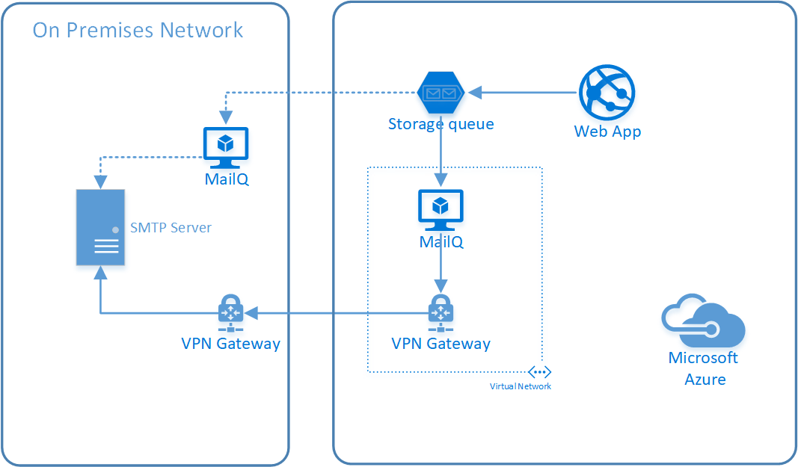

Simple Azure Storage Mail Queue Processor
-----------------------------------------

This repository contains a simple service that can be used to process serialized `System.Net.Mail.MailMessage` objects from an [Azure Storage Queue](https://azure.microsoft.com/en-us/services/storage/queues/). The applications and utility library are written using .NET Core 2.0.

When organizations move web applications to the cloud, they often look to hosting environments such as Azure [Web Apps](https://docs.microsoft.com/en-us/azure/app-service/app-service-web-overview). A Web App will typically not have access to the on-prem network unless steps are taken to connect it using either an [App Service Environment](https://docs.microsoft.com/en-us/azure/app-service/environment/intro) or [Web App Virtual Network integration](https://docs.microsoft.com/en-us/azure/app-service/web-sites-integrate-with-vnet) in combination with Express Route or VPN connection. Often the applications will need to send email to users and when the applications were hosted on-prem, it was possible use a locally configured SMTP relay. In the cloud, the application may not have access to this relay and a simple task like sending email becomes more complicated. There are tools such as [SendGrid](https://sendgrid.com/) that can be leveraged but for some organizations (e.g., Government Agencies) use of such services may break compliance with [TIC](https://www.dhs.gov/trusted-internet-connections) rules.

Another option is to have the Web App enqueue mail messages on a storage queue in the cloud and have an application on-prem do the actual sending of emails through the local SMTP server. The application in this repository does just that. 

The `MailQ` application is available as [Docker image](https://hub.docker.com/r/hansenms/mailq/) and it can be run with a command line:

```
docker run -e ConnectionString='<Azure Storage Account Connection String>' -e MailQueueName='<Name of Queue>' -e SmtpServer='<SMTP domainName>' hansenms/mailq
```

There are several ways it can be deployed. One option would be to run this Docker container directly on the on-prem network, another would be in a virtual network that is peered with the on-prem network through VPN connections or Express Route. The illustration below shows both options. 



Once the `MailQ` service is deployed you can use the `MailSender` test application to send an email to the storage queue. You will need to set the following environment variables: `ConnectionString`, `MailQueueName`, and `SmtpServer`. You can run the client with:

```
cd MailSender
dotnet run
```

You will be prompted for email addresses, subject and message body. 

Both the `MailQ` service and the `MailSender` test application use a `SerializeableMailMessage` class, which I found [here](https://github.com/keyvan/Gopi/blob/master/Gopi/Gopi/SerializableMailMessage.cs) and I made a few modifications to it. This class is used to serialize and deserialize `System.Net.Mail.MailMessage` objects.